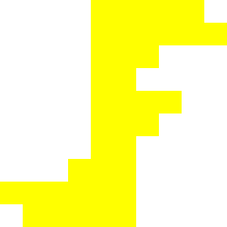

[![Contributors][contributors-shield]][contributors-url]
[![Stargazers][stars-shield]][stars-url]
[![Issues][issues-shield]][issues-url]
 

  
<h3 align="center">Five Nights At Jimmy's</h3>
  

    This is a fun browser FNAF fan game I made from scratch.
     
     
    <a href="https://fnaj.jdbdu.org/">Play Online</a>
    ·
    <a href="https://github.com/NonzeroCornet/FNAFBrowser/issues">Report Bug</a>
    ·
    <a href="https://github.com/NonzeroCornet/FNAFBrowser/issues">Request Feature</a>
  

## Contact
Brian Dean Ullery - @nonzerocornet34 - [ullerbri000@gmail.com](mailto:ullerbri000@gmail.com)

Project Link: [https://github.com/NonzeroCornet/FNAFBrowser](https://github.com/NonzeroCornet/FNAFBrowser)

[contributors-shield]: https://img.shields.io/github/contributors/NonzeroCornet/FNAFBrowser.svg?style=for-the-badge
[contributors-url]: https://github.com/NonzeroCornet/FNAFBrowser/graphs/contributors
[stars-shield]: https://img.shields.io/github/stars/NonzeroCornet/FNAFBrowser.svg?style=for-the-badge
[stars-url]: https://github.com/NonzeroCornet/FNAFBrowser/stargazers
[issues-shield]: https://img.shields.io/github/issues/NonzeroCornet/FNAFBrowser.svg?style=for-the-badge
[issues-url]: https://github.com/NonzeroCornet/FNAFBrowser/issues
